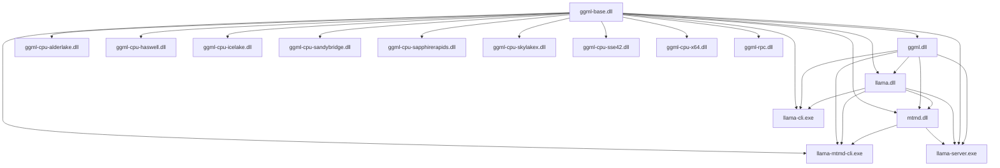

```mermaid
flowchart TD;
ggml-base.dll --> ggml.dll
ggml-base.dll --> ggml-cpu-alderlake.dll
ggml-base.dll --> ggml-cpu-haswell.dll
ggml-base.dll --> ggml-cpu-icelake.dll
ggml-base.dll --> ggml-cpu-sandybridge.dll
ggml-base.dll --> ggml-cpu-sapphirerapids.dll
ggml-base.dll --> ggml-cpu-skylakex.dll
ggml-base.dll --> ggml-cpu-sse42.dll
ggml-base.dll --> ggml-cpu-x64.dll
ggml-base.dll --> ggml-rpc.dll
ggml-base.dll --> llama.dll
ggml.dll --> llama.dll
ggml-base.dll --> mtmd.dll
ggml.dll --> mtmd.dll
llama.dll --> mtmd.dll
mtmd.dll --> llama-server.exe
llama.dll --> llama-server.exe
ggml-base.dll --> llama-server.exe
ggml.dll --> llama-server.exe
ggml-base.dll --> llama-cli.exe
ggml.dll --> llama-cli.exe
llama.dll --> llama-cli.exe
ggml-base.dll --> llama-mtmd-cli.exe
ggml.dll --> llama-mtmd-cli.exe
llama.dll --> llama-mtmd-cli.exe
mtmd.dll --> llama-mtmd-cli.exe
```
