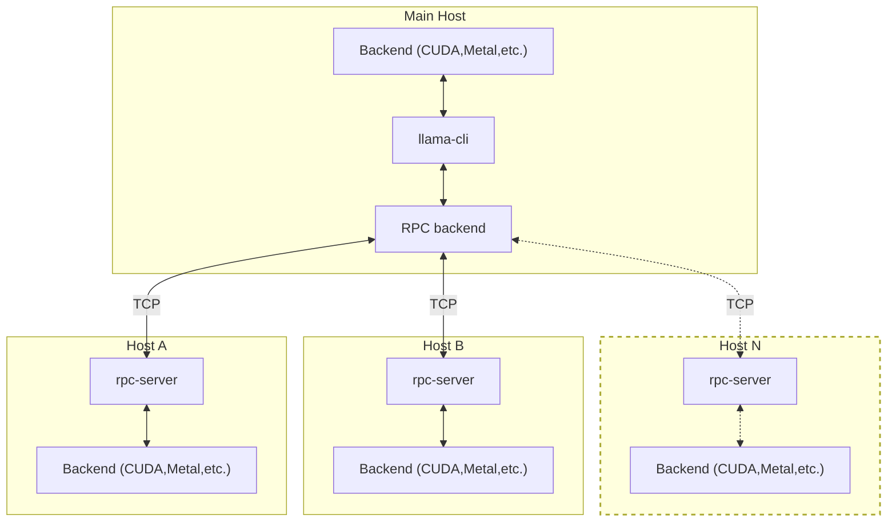

## 1 Overview
```c
/*
Note:杨小兵-2025-01-13

1、这部分内容介绍RPC相关的内容
*/
```

> [!IMPORTANT]
> This example and the RPC backend are currently in a proof-of-concept development stage. As such, the functionality is fragile and
> insecure. **Never run the RPC server on an open network or in a sensitive environment!**
```c
/*
Note:杨小兵-2025-01-13

1、注意：此示例和 RPC 后端目前处于概念验证开发阶段。因此，该功能很脆弱且不安全。切勿在开放网络或敏感环境中运行 RPC 服务器！
2、这个例子目前处于开发阶段需要谨慎使用。
*/
```

The `rpc-server` allows  running `ggml` backend on a remote host.
The RPC backend communicates with one or several instances of `rpc-server` and offloads computations to them.
This can be used for distributed LLM inference with `llama.cpp` in the following way:
```c
/*
Note:杨小兵-2025-01-13

1、rpc-server允许将ggml backend运行在一个remote host上。
2、介绍了如何使用 `rpc-server` 通过 RPC 后端在远程主机上运行 `ggml` 后端，从而实现计算任务的分布式处理。这种方法可以与 `llama.cpp` 结合，进行分布式大型语言模型（LLM）的推理，提升计算效率和性能。
*/
```


```c
/*
Note:杨小兵-2025-01-13

1、Mermaid 是一种基于文本的图表和流程图生成工具。它允许用户使用简洁的语法在 Markdown 文件、文档或代码注释中嵌入图表定义，然后通过渲染工具将这些定义转换为可视化的图表。Mermaid 支持多种图表类型，包括流程图、序列图、甘特图、类图、状态图、实体关系图（ER 图）等。
2、Mermaid 通过简洁的文本语法和强大的图表支持，广泛应用于各种需要图形化表达的场景，极大地提升了文档的可读性和维护效率，是开发者、技术写作者和项目经理等专业人士的得力工具。
*/
```

Each host can run a different backend, e.g. one with CUDA and another with Metal.
You can also run multiple `rpc-server` instances on the same host, each with a different backend.
```c
/*
Note:杨小兵-2025-01-13

1、每一个host可以运行不同的backend，例如一个host运行CUDA backend，另外一个host运行Metal backend。你也可以在同一个host上运行多个rpc-server实例，每个rpc-server有着不同的backend。
*/
```

## 2 Usage

On each host, build the corresponding backend with `cmake` and add `-DGGML_RPC=ON` to the build options.
For example, to build the CUDA backend with RPC support:
```c
/*
Note:杨小兵-2025-01-13

1、在每一个host上，使用cmake构建对应的backend，并且添加cmake命令行参数-DGGML_RPC=ON（预处理器宏）作为构建选项。例如使用下列命令构建具有RPC支持的CUDA后端。
*/
```

```bash
mkdir build-rpc-cuda
cd build-rpc-cuda
cmake .. -DGGML_CUDA=ON -DGGML_RPC=ON
cmake --build . --config Release
```

Then, start the `rpc-server` with the backend:

```bash
$ bin/rpc-server -p 50052
create_backend: using CUDA backend
ggml_cuda_init: GGML_CUDA_FORCE_MMQ:   no
ggml_cuda_init: CUDA_USE_TENSOR_CORES: yes
ggml_cuda_init: found 1 CUDA devices:
  Device 0: NVIDIA T1200 Laptop GPU, compute capability 7.5, VMM: yes
Starting RPC server on 0.0.0.0:50052
```

When using the CUDA backend, you can specify the device with the `CUDA_VISIBLE_DEVICES` environment variable, e.g.:
```bash
$ CUDA_VISIBLE_DEVICES=0 bin/rpc-server -p 50052
```
This way you can run multiple `rpc-server` instances on the same host, each with a different CUDA device.
```c
/*
Note:杨小兵-2025-01-13

1、通过CUDA_VISIBLE_DEVICES环境变量来指定不同的CUDA device从而在相同的host上运行多个rpc-server
*/
```

On the main host build `llama.cpp` for the local backend and add `-DGGML_RPC=ON` to the build options.
Finally, when running `llama-cli`, use the `--rpc` option to specify the host and port of each `rpc-server`:
```c
/*
Note:杨小兵-2025-01-13

1、在main host上为本地后端构建`llama.cpp`，并将`-DGGML_RPC=ON`添加到构建选项中。最后，在运行`llama-cli`时，使用`--rpc`选项指定每个`rpc-server`的主机和端口：
*/
```

```bash
$ bin/llama-cli -m ../models/tinyllama-1b/ggml-model-f16.gguf -p "Hello, my name is" --repeat-penalty 1.0 -n 64 --rpc 192.168.88.10:50052,192.168.88.11:50052 -ngl 99
```

This way you can offload model layers to both local and remote devices.
```c
/*
Note:杨小兵-2025-01-13

1、通过这种方式可以将model layers分散到local和remote devices上。
*/
```
